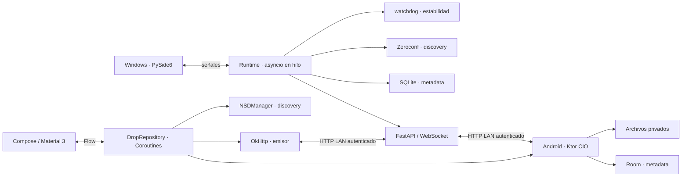

# Arquitectura implementada

Cada peer tiene identidad UUID persistente. IP/puerto son localizadores que
mDNS actualiza, nunca identidad. Heartbeat valida que la dirección siga
respondiendo con el UUID esperado. El descubrimiento puede fallar sin impedir
el pairing por IP. No hay ninguna conexión a servicios externos en ejecución.

El receptor exige una oferta aprobada antes del multipart. El parser incremental
guarda primero metadata acotada y escribe el binario en `.devicedrop-part`.
Se compara tamaño/hash, se publica sin sobrescribir y se confirma al emisor.
Retries conservan transfer_id y las ofertas reconocen resultados ya confirmados.
Transferencia simultánea limitada a dos envíos por emisor; ofertas limitadas a 64.

Windows posee servicios separados para discovery, pairing, transferencia,
eventos y watcher, coordinados por Runtime con una inyección de dependencias
simple. La UI administra las páginas de inicio, dispositivos, carpeta compartida,
historial y configuración. Android usa un repositorio coordinador con DAO, servidor
y discovery separados; no hay microservicios. El servicio foreground solo mantiene
servidor/discovery/heartbeat mientras la recepción está activa.

Se detectan created/modified/moved/deleted. Solo created produce auto-sync.
Los temporales y los archivos marcados como recibidos se excluyen; las carpetas
se mantienen separadas. Los binarios no se almacenan en bases de datos.

Quit detiene Uvicorn, cancela envíos/heartbeat, detiene watchdog y cierra Zeroconf
antes de cerrar SQLite. Android Stop detiene servidor, NSD y heartbeat.
No hay reanudación ni replicación de eliminaciones en V1.
